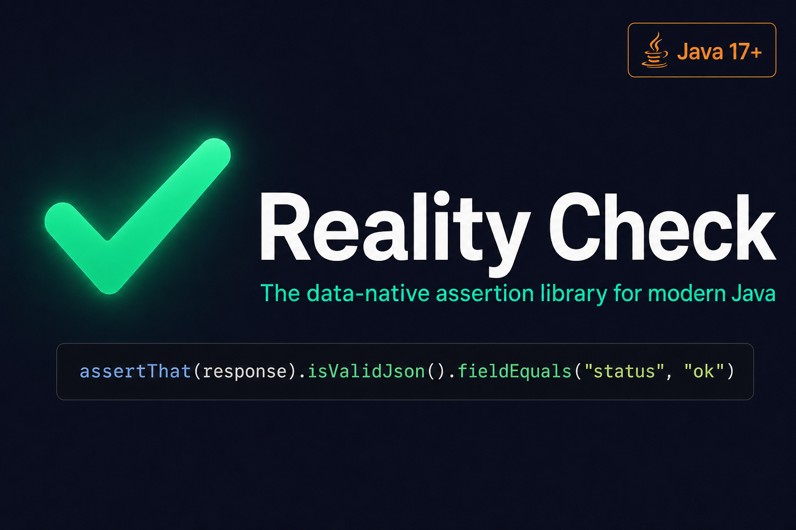

<div align="center">



[](https://github.com/imetaxas/realitycheck/actions)
[](https://central.sonatype.com/artifact/io.github.imetaxas/realitycheck-core)
[](https://codecov.io/gh/imetaxas/realitycheck)
[](https://opensource.org/licenses/Apache-2.0)
[](https://imetaxas.github.io/realitycheck/)

**A fluent assertion library for Java 17+ with first-class support for JSON, CSV, XML, YAML, URIs, snapshot testing, and more.**

[**Quick Start**](#quick-start) · [**Full Usage Guide**](docs/USAGE.md) · [**Migration from AssertJ / Truth**](MIGRATION.md) · [**Roadmap**](docs/ROADMAP.md) · [**Javadoc**](https://imetaxas.github.io/realitycheck/)

Assertion missing? [Open an issue](https://github.com/imetaxas/realitycheck/issues) — contributions are welcome!

</div>

---

## Quick Start

**Maven:**

```xml
<dependency>
    <groupId>io.github.imetaxas</groupId>
    <artifactId>realitycheck-core</artifactId>
    <version>1.0.0</version>
    <scope>test</scope>
</dependency>
```

**Gradle (Kotlin DSL):**

```kotlin
testImplementation("io.github.imetaxas:realitycheck-core:1.0.0")
```

**Gradle (Groovy DSL):**

```groovy
testImplementation 'io.github.imetaxas:realitycheck-core:1.0.0'
```

> Using multiple modules? See the [BOM setup](docs/USAGE.md#bom-setup) to manage versions in one place.

### Copy · Paste · Run

```java
import static io.github.imetaxas.realitycheck.RealityAssertions.*;
import static io.github.imetaxas.realitycheck.json.JsonReality.*;
import org.junit.jupiter.api.Test;

class QuickStartTest {

    @Test
    void strings() {
        assertThat("hello world").isNotEmpty().startsWith("hello").hasLength(11);
    }

    @Test
    void json() {
        String response = "{\"user\":{\"name\":\"Alice\",\"roles\":[\"admin\"]}}";
        assertThatJson(response)
            .isValidJson()
            .fieldEquals("user.name", "Alice")
            .fieldIsArray("user.roles");
    }

    @Test
    void exceptions() {
        assertThatThrownBy(() -> Integer.parseInt("oops"))
            .isInstanceOf(NumberFormatException.class)
            .hasMessageContaining("oops");
    }

    @Test
    void softAssertions() {
        String name = "Alice";
        int age = 30;
        String email = "alice@example.com";
        assertAll(softly -> {
            softly.assertThat(name).isNotEmpty();
            softly.assertThat(age).isPositive();
            softly.assertThat(email).contains("@");
        });
    }
}
```

> **Coming from AssertJ or Truth?** `assertThat` works out of the box — same muscle memory, zero friction. See the [migration guide](MIGRATION.md).

### What failure messages look like

```
assertThat("hello").isEqualTo("world");
→ expected: <world> but was: <hello>

assertThatJson(json).fieldEquals("user.name", "Bob");   // requires realitycheck-json
→ expected field <user.name> = <Bob> but was: <Alice>

assertThatSnapshot(response).matchesSnapshot(...);       // requires realitycheck-snapshot
→ snapshot differs:
-   "status": "ok"
+   "status": "error"
```

---

## Why Reality Check?

| Feature | JUnit 5 | Google Truth | AssertJ | Reality Check |
|---|:---:|:---:|:---:|:---:|
| JSON structural diff | — | — | — | ✅ |
| CSV assertions (RFC 4180) | — | — | — | ✅ |
| XML assertions (XPath, XXE-safe) | — | — | — | ✅ |
| YAML assertions (dot-path) | — | — | — | ✅ |
| Snapshot / golden-file testing | — | — | — | ✅ |
| Map dot-path navigation | — | — | — | ✅ |
| Regex capture group assertions | — | — | — | ✅ |
| URI/URL component assertions | — | — | Limited | ✅ |
| Multiline diff in failure messages | — | — | — | ✅ |
| Execution timing assertions | — | — | — | ✅ |
| Exception cause chain traversal | — | Limited | Limited | ✅ |
| Suppressed exception access | — | [Missing](https://github.com/google/truth/issues/717) | — | ✅ |
| Thread-safe soft assertions | ❌ (stateless) | [JUnit 4 only](https://github.com/google/truth/issues/893) | [Buggy](https://github.com/assertj/assertj/issues/2356) | ✅ |
| Fluent method chaining | ❌ | [No](https://github.com/google/truth/issues/884) | ✅ | ✅ |
| Zero-boilerplate custom extension | — | ~50 lines | ~30 lines | **3 lines** |
| Zero runtime dependencies (core) | ✅ | ❌ (Guava) | ✅ | ✅ |
| `assertThat()` drop-in alias | — | ✅ | ✅ | ✅ |
| Modern Java (17+, records, sealed) | Java 8 | Java 8 | Java 8 | **Java 17+** |

---

## Modules

| Module | Artifact ID | What it adds | Extra deps |
|---|---|---|---|
| Core | `realitycheck-core` | String, number, collection, map, file, URI, CSV, date/time, exception, execution, array, stream, iterable, multiline, enum, UUID, byte[] | None |
| JSON | `realitycheck-json` | JSON structural diff, dot-path, array-index navigation | Jackson |
| XML | `realitycheck-xml` | XPath assertions, XXE-safe parsing | JDK only |
| YAML | `realitycheck-yaml` | YAML dot-path queries | SnakeYAML |
| Snapshot | `realitycheck-snapshot` | Golden-file snapshot testing | None |
| JUnit 5 | `realitycheck-junit5` | `@WithSoftChecks` parameter injection | JUnit Jupiter API |
| BOM | `realitycheck-bom` | Version alignment for multi-module use | — |

---

## Philosophy: No Reflection. No Surprises.

Reality Check uses explicit, user-defined assertions instead of reflective object traversal. Custom checks are **3 lines** with Java records:

```java
record MoneyCheck(Money actual, FailureHandler failureHandler)
        implements Check<MoneyCheck, Money> {
    @Override public MoneyCheck self() { return this; }

    public MoneyCheck hasCurrency(String code) {
        return failureHandler.check(self(),
            actual.getCurrency().equals(code),
            "expected currency <%s> but was <%s>", code, actual.getCurrency());
    }
}

assertThat(payment, MoneyCheck::new).hasCurrency("USD");
```

See [DESIGN_DECISIONS.md](DESIGN_DECISIONS.md) for the full rationale.

---

## Documentation

| Document | Description |
|---|---|
| [docs/USAGE.md](docs/USAGE.md) | Full API reference — all assertion types with examples |
| [MIGRATION.md](MIGRATION.md) | Step-by-step migration from AssertJ and Google Truth |
| [docs/ROADMAP.md](docs/ROADMAP.md) | What shipped in v1.0 and what's coming next |
| [CHANGELOG.md](CHANGELOG.md) | Release history |
| [DESIGN_DECISIONS.md](DESIGN_DECISIONS.md) | Why no reflection, soft assertion design, extension model |
| [CONTRIBUTING.md](CONTRIBUTING.md) | Development setup, coding standards, PR process |
| [Javadoc](https://imetaxas.github.io/realitycheck/) | Full API reference |

---

## Requirements

- **Java 17+**
- **JUnit 5** (test scope)

## Building

```bash
mvn clean verify
```

## License

[Apache License 2.0](LICENSE)
